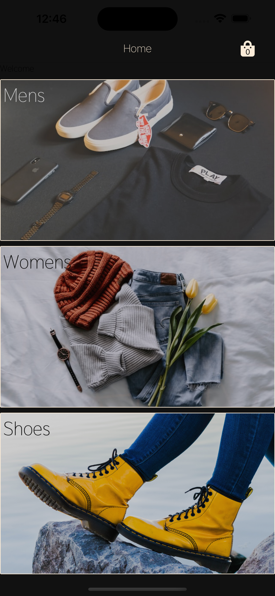
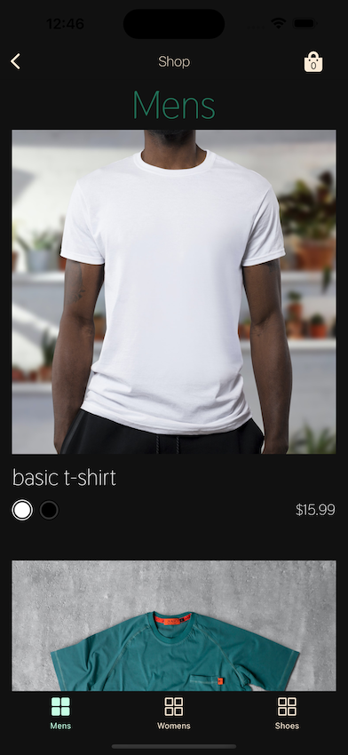
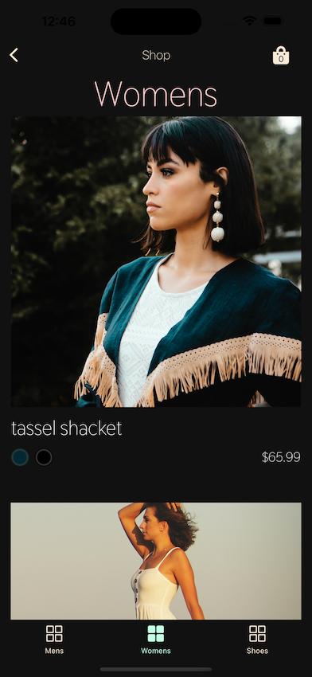
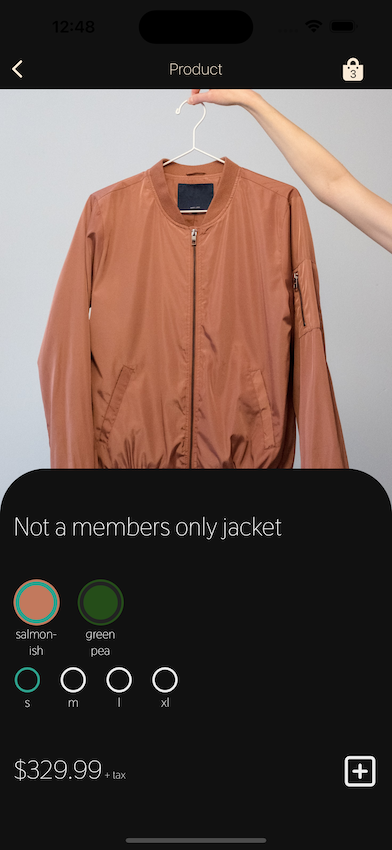
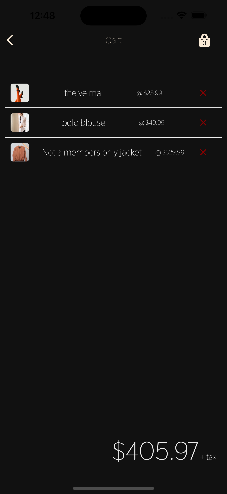

# E-Commerce Clothing App

---

This is a simple, mock-up clothing application built with React Native.
The purpose of building it? Enhance my knowledge of working with React Native. I learned a ton, just as I had hoped. Anyone taking the time to read this, please feel free to clone the repo and send me cool changes/additions you'd make. I'm still fresh to React Native and am excited to learn more.

---

## Screenshots:

